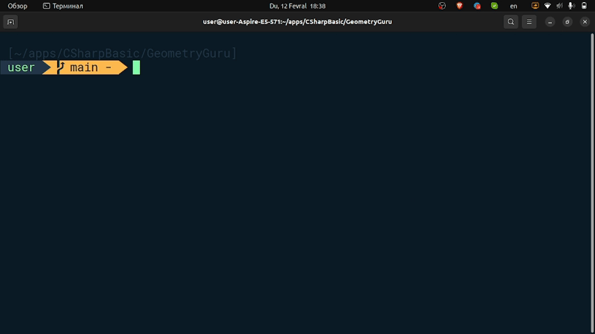
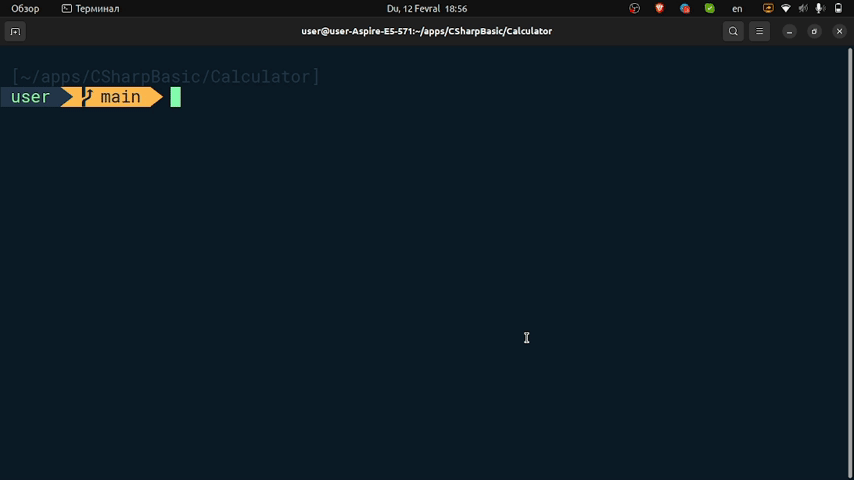
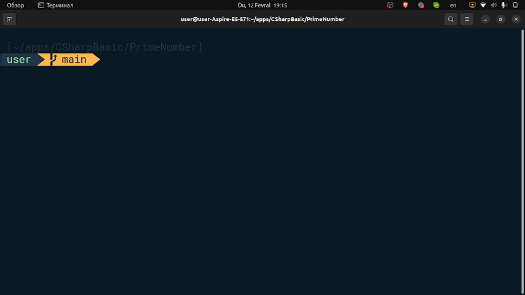
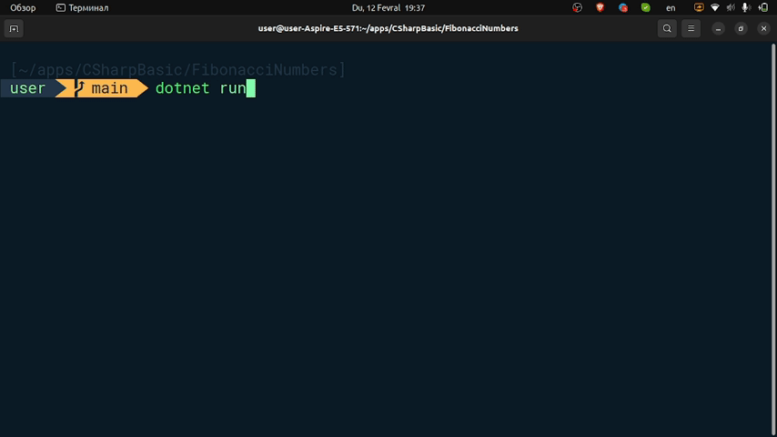

# CSharpBasic

## Geomery Guru
##### Ushbu kod dasturi foydalanuvchiga geometriyaviy shakllar yuzasini hisoblash imkoniyatini taqdim etadi. Kod boshida foydalanuvchiga aylananing, uchburchakning yoki to'rtburchakning yuzasini topish uchun tanlov qilish imkoniyatini beradi. Tanlangan amalga ko'ra, foydalanuvchi qo'shiladigan qiymatlar bo'yicha hisoblash amalga oshiriladi va natija ekranga chiqariladi.

###### Demanstration

## Calculator
##### Bu kod foydalanuvchining kiritgan ikki son orasida kiritilgan amalni bajaradi va natijani ekranga chiqaradi. Agar amal bo'lish ("+") amalni kiritilgan sonlarni qo'shadi, ayirma ("-") amal kiritilgan sonlarni ayiradi, ko'paytirish ("*") amal kiritilgan sonlarni ko'paytiradi va bo'lish ("/") amal kiritilgan sonlarni bo'lishini hisoblaydi. Agar bo'linadigan son nolga teng bo'lsa, dastur "Xato: 0 ga bo'lib bo'linmadi!" deb chiqaradi.

###### Demanstration

## Prime Number
##### Bu kod foydalanuvchining kiritgan sonning tub son ekanligini tekshiradi. Agar kiritilgan son faqat 1 va o'ziga bo'linishi mumkin bo'lsa, u tub son hisoblanadi. Aks holda, u tub son emas deyiladi.

###### Demanstration

## Fibonacci Number
##### Bu kod foydalanuvchi tomonidan kiritilgan soncha Fibonacci ketma-ketlikning birinchi sonlarini ekranga chiqaradi. Foydalanuvchi kiritgan soncha sonlar ko'rsatiladi. Fibonacci ketma-ketlikning birinchi soni 0 deb e'lon qilinadi, ikkinchi esa 1. Dastur kiritilgan soncha sonlarni hisoblab, ularni ekranga chiqaradi.

###### Demanstration

## IELSTSscore
##### Bu kod foydalanuvchi tomonidan kiritilgan IELTS (Ixtisosiy Ingliz Tili Testi) bo'limlari uchun o'rtacha baho va qoldiqni hisoblaydi va "Average score" degan nom bilan konsolga chiqaradi. Foydalanuvchi "Listening", "Reading", "Speaking" va "Writing" bo'lim

###### Demanstration
.gif>)

## Quiz Game
##### Bu dastur "Quiz Game" o'yini uchun bir kodni ifodalaydi. Bu o'yin foydalanuvchining bir so'zni topish uchun urinishlarini qabul qiladi va unga baholar beradi. Quyidagi funksiyalar mavjud:

- `GetRandomWord`: Berilgan so'zlardan tasodifiy birini tanlaydi.
- `IsLetterExists`: Belgi berilgan so'zda mavjud bo'lsa `true` qaytaradi.

##### O'yin o'z ichiga olgan qulay va oson tushunchalar bilan foydalanuvchini boshqarishga imkon beradi.

###### Demanstration
.gif>)